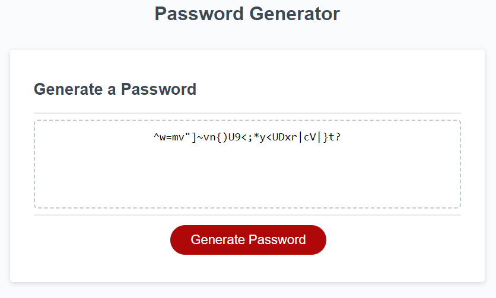

# Password Generator

## Description

Welcome to my password generator! I built this password generator to make keeping accounts secure easier than ever. A lot of people, myself included, tend to create passwords that are easy to guess or brute force. This program takes the thinking out of password generation. This can also be used for generating temporary keys for one-time logins or first time login account creation. In the production of this project I learned a lot about array methods and in particular array methods as they relate to multidimensional arrays

## Usage

To generate a password click 'Generate Password' at the bottom of the central box.
it will first ask if you want uppercase, then lowercase letters, then special characters, and lastly numbers. if you fail to select any the program will disply a message to tell the user to make a selection. the program allows any combination of the four options available. after making a selection you will be asked for your desired password length from 8 to 128. typing anything except for numbers from 8-128 will result in an 'Invalid entry' message and an appropriate message based on what was typed. additionally, the program also accounts for decimal entries to avoid cheeky trolls. once it accepts your entry it will display your password where 'Your Secure Password' is desplayed.

## License

MIT License

## How to Contribute

Contributions are not being accepted at this time.

## Tests

tests included entering 7, 129, 'butt', and 8.9. I also tested all combinations of the four options.
